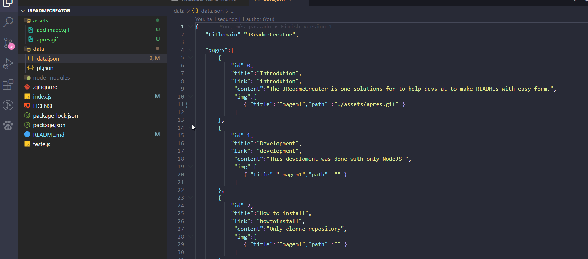
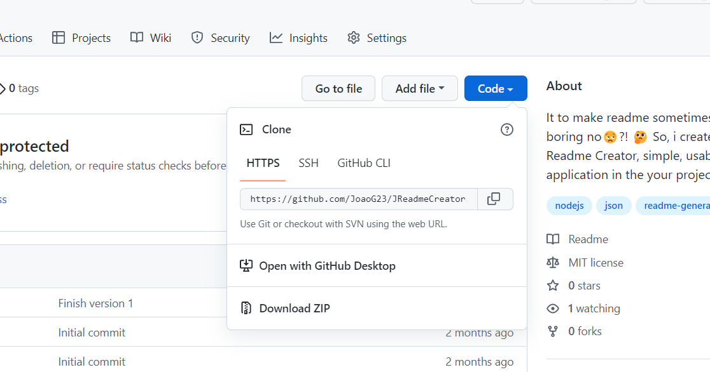
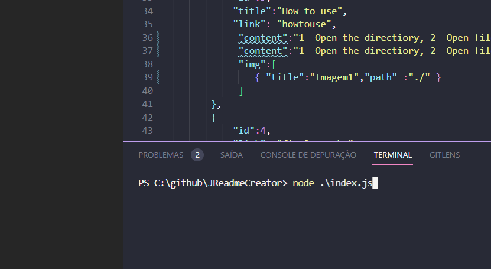

<h1>JReadmeCreator</h1>

        

Alterações | Data | Autor
:---------: | :------: | :------:
Emissão Inicial | 26/03/2022 | Nome do Desenvolvedor

<ol><li> <a href="#introdution"> Introdution</a> •</li><li> <a href="#development"> Development</a> •</li><li> <a href="#howtoinstall"> How to install</a> •</li><li> <a href="#howtouse"> How to use</a> •</li><li> <a href="#finalremarks"> Final remarks</a> •</li><li> <a href="#Authors"> Authors</a> •</li><li> <a href="#license"> license</a> •</li></ol>undefined

                            <h3>Introdution</h3>
                            
                            
 The JReadmeCreator is one solutions for to help devs at to make READMEs with easy form.

                             
                            

                            <h3>Development</h3>
                            
                            
  * This develoment was done with only NodeJS for help in the my docs of readmes 

                             
                            

                            <h3>How to install</h3>
                            
                            
 Only clonne repository

                             
                            

                            <h3>How to use</h3>
                            
                            
 1- Open the directiory, 
 2- Open file data.json, 
 3- Modify the json for create your README, 
  4- If you to want, you can put in images in inside data.json

                             
                            

                            <h3>Final remarks</h3>
                            
                            
 The project not is the better of world.

                             
                            

                            <h3>Authors</h3>
                            
                            
 Only I

                             
                            

                            <h3>license</h3>
                            
                            
 MIT

                             
                            
